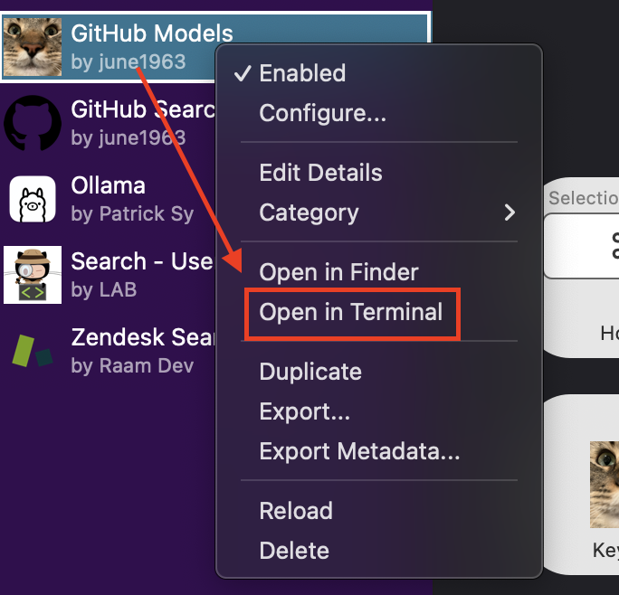

# AI Text Processing Alfred Workflow

An Alfred workflow that provides powerful AI-powered text processing capabilities using Azure AI services via GitHub Models.

This project was heavily inspired by [`zeitlings/alfred-ollama`](https://github.com/zeitlings/alfred-ollama)! ❤️

## Features

- Process text with various AI-powered actions
- Multiple processing modes:
  - Follow Instructions
  - Answer Questions
  - Condense Text
  - Paraphrase
  - Summarize
  - Explain
  - Expand
  - Improve
  - Correct Spelling
- Summary Formats:
  - Bullet Points
  - TL;DR
  - Executive Summary
- Tone Modifications:
  - Professional
  - Casual
  - Friendly
  - Diplomatic
  - Confident
  - Simple

## Requirements

- Alfred 5 with Powerpack
- Python 3.9+
- GitHub fine-grained PAT with `models:read` permissions (ensure `Public repositories` is selected)

## Installation

1. Download the [latest release](https://github.com/june1963/Alfred-GitHub-Models/releases/latest), i.e., `GitHub-Models-vX.Y.Z.alfredworkflow`
2. Double click the downloaded `GitHub-Models-vX.Y.Z.alfredworkflow` file to install in Alfred
3. Right click the installed `GitHub Models` workflow in the Alfred sidebar UI and click `Open in Terminal`:
<details style="margin-left: 2em;">

<summary>📌 Click to show screenshot image</summary>



</details>

4. Grant executable permissions to the scripts `script-filter.py` and `run-script.py`:

    ```shell
    chmod +x "./"{run-script.py,script-filter.py}
    ```

<details style="margin-left: 2em;">

<summary>📌 How to check</summary>

This should update the files accordingly:

    ```shell
    # Without executable permissions
    $ ls -lah | grep ".py"
    -rw-rw-rw-  1 codespace root  19K Apr 18 21:45 run-script.py
    -rw-rw-rw-  1 codespace root 4.0K Apr 18 21:45 script-filter.py

    # With executable permissions
    $ ls -lah | grep ".py"
    -rwxrwxrwx  1 codespace root  19K Apr 18 21:45 run-script.py
    -rwxrwxrwx  1 codespace root 4.0K Apr 18 21:45 script-filter.py
    ```

</details>

5. Create a virtual environment and activate it:

    ```shell
    python3 -m venv workflow-venv && source workflow-venv/bin/activate
    ```
6. Install the required packages:

  - Install `azure-core`, `azure-ai-inference`, and `openai` packages directly:

    ```shell
    pip install azure-core azure-ai-inference openai 
    ```

  - OR install via the `requirements.txt` from the workflow directory:

    ```shell
    pip install -r requirements.txt
    ```

## Configuration

Set up your preferred hotkey for the workflow, e.g., `⌘+Shift+1`. You can also configure the workflow to use a specific model by setting the `MODEL_NAME` configuration variable.

The workflow supports the following configuration variables:

- `API_KEY`: Your GitHub PAT with `models:read` permissions
- `ENDPOINT`: The AI inferencing endpoint (default: `https://models.inference.ai.azure.com`)
- `MODEL_NAME`: GitHub model name (default: `o3-mini`)
- `MAX_TOKENS`: Maximum tokens for responses
- `MAX_COMPLETION_TOKENS`: Maximum tokens for o1-mini and o3 mini models
- `TEMPERATURE`: Control response randomness (0.01-1.0)
- `SYSTEM_PROMPT`: Optional custom system prompt
- `OUTPUT_AS_MARKDOWN`: Output responses in Markdown format (true/false)
- `DEBUG`: Enable debug logging (true/false)

## Usage

1. Select the text you want to process
2. Activate Alfred and type your hotkey (e.g., `⌘+Shift+1`)
3. Choose the desired action from the list
4. Wait for the AI to process the text, which may take a few seconds
5. The processed text will be displayed in the active window

## License

MIT License - see [LICENSE](LICENSE) for details

## Author

Copyright (c) 2025 [june1963](https://github.com/june1963)
